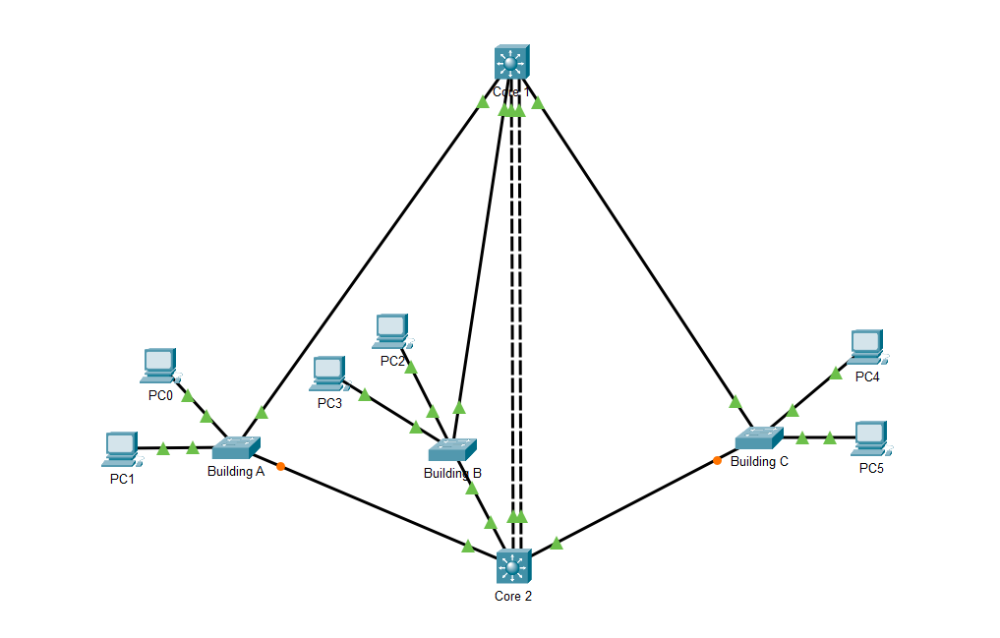
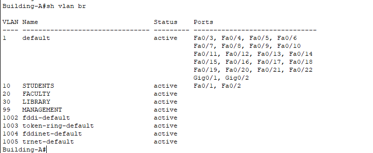
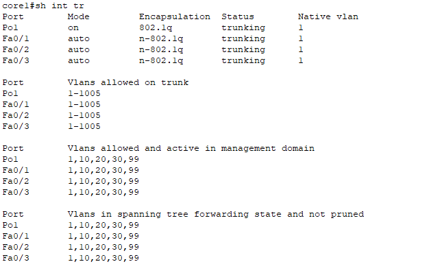
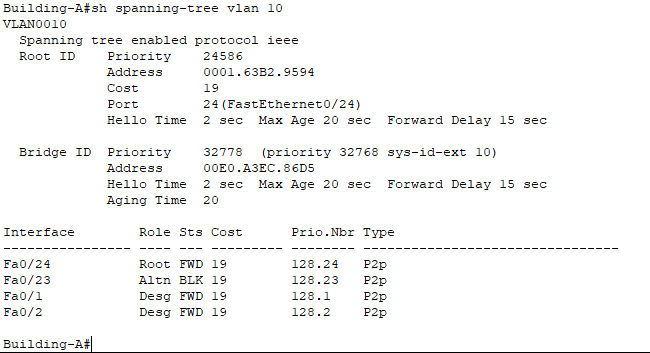
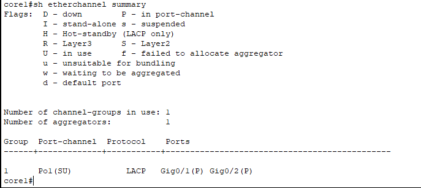
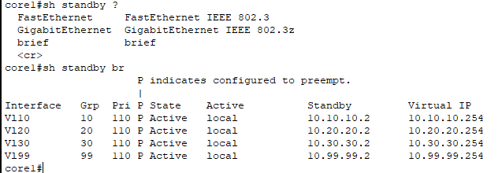
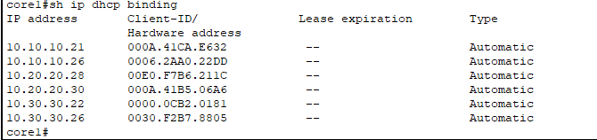
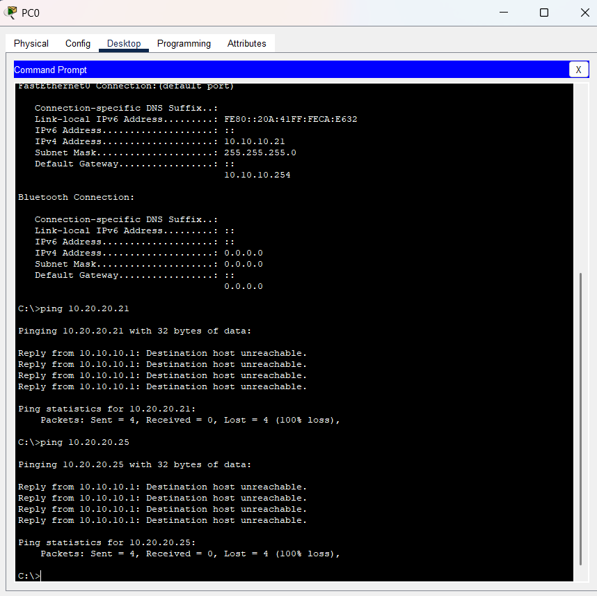
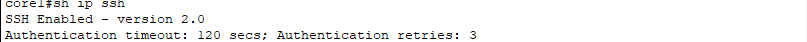
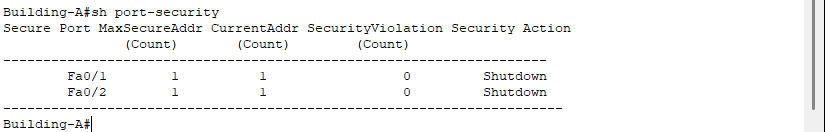

# 🏢 Enterprise Campus Network Design

<div align="center">


**A production-grade enterprise campus network simulating real-world infrastructure with redundancy, segmentation, and security — built entirely in Cisco Packet Tracer.**

</div>

---

## 📌 Project Overview

This project demonstrates the end-to-end design, implementation, and verification of a **secure, scalable, and highly available enterprise campus network** using a **Core-Access hierarchical architecture**.

The simulation models a real campus environment where three departments — **Students, Faculty, and Library** — operate independently with controlled inter-department communication, gateway redundancy, centralized management, and port-level security.

> 💡 *Every technology listed below was configured from scratch, verified with Cisco IOS commands, and troubleshot through real issues encountered during implementation.*

---

## 🗺️ Network Topology

  
```

### Device Inventory

| Device | Model | Role |
|--------|-------|------|
| **Core1** | Cisco 3560 L3 Switch | Primary Routing · DHCP Server · HSRP Active |
| **Core2** | Cisco 3560 L3 Switch | Redundant Routing · HSRP Standby |
| **Building-A** | Cisco 2960 Switch | Student Network Access |
| **Building-B** | Cisco 2960 Switch | Faculty Network Access |
| **Building-C** | Cisco 2960 Switch | Library Network Access |

---

## 🔌 VLAN Design & IP Addressing

### VLAN Segmentation

| VLAN ID | Name | Purpose | Subnet | Virtual Gateway (HSRP) |
|---------|------|---------|--------|------------------------|
| **10** | STUDENTS | Student Department | `10.10.10.0/24` | `10.10.10.254` |
| **20** | FACULTY | Faculty Department | `10.20.20.0/24` | `10.20.20.254` |
| **30** | LIBRARY | Library Department | `10.30.30.0/24` | `10.30.30.254` |
| **99** | MANAGEMENT | Network Management | `10.99.99.0/24` | `10.99.99.254` |

### Core Switch SVI Addressing

| Interface | Core1 | Core2 |
|-----------|-------|-------|
| VLAN 10 | `10.10.10.1` | `10.10.10.2` |
| VLAN 20 | `10.20.20.1` | `10.20.20.2` |
| VLAN 30 | `10.30.30.1` | `10.30.30.2` |
| VLAN 99 (Mgmt) | `10.99.99.1` | `10.99.99.2` |

### Management IP Addresses

| Device | Management IP |
|--------|--------------|
| Core1 | `10.99.99.1` |
| Core2 | `10.99.99.2` |
| Building-A | `10.99.99.11` |
| Building-B | `10.99.99.12` |
| Building-C | `10.99.99.13` |

---

## ⚙️ Technologies Implemented

### 1. 🔲 VLAN Segmentation
Isolated departmental traffic into separate broadcast domains, reducing unnecessary traffic and improving security posture across the network.

### 2. 🔗 IEEE 802.1Q Trunking
Configured trunk links between all switches to carry VLANs 10, 20, 30, and 99 across shared physical uplinks.

### 3. 🔄 Inter-VLAN Routing
Used **Switch Virtual Interfaces (SVIs)** on the Layer 3 core switches to enable controlled routing between VLANs — eliminating the need for a dedicated router.

### 4. 🌲 Spanning Tree Protocol (STP)
Prevented Layer 2 loops across redundant uplinks. Core1 was elected **Root Primary** and Core2 as **Root Secondary** through manual priority configuration.

| Device | STP Role |
|--------|----------|
| Core1 | Root Primary |
| Core2 | Root Secondary |

### 5. ⚡ EtherChannel (LACP)
Two physical links between Core1 and Core2 were bundled into **Port-Channel 1** using LACP, doubling bandwidth and providing automatic failover.

| Port-Channel | Protocol | Member Links |
|---|---|---|
| Port-Channel 1 | LACP | G0/1 ↔ G0/1 · G0/2 ↔ G0/2 |

### 6. 🛡️ HSRP Version 2 (Gateway Redundancy)
Clients use a single **virtual gateway IP** per VLAN. If Core1 fails, Core2 automatically takes over — with zero manual reconfiguration needed on end devices.

| VLAN | Virtual Gateway | Active | Standby |
|------|----------------|--------|---------|
| 10 | `10.10.10.254` | Core1 | Core2 |
| 20 | `10.20.20.254` | Core1 | Core2 |
| 30 | `10.30.30.254` | Core1 | Core2 |
| 99 | `10.99.99.254` | Core1 | Core2 |

### 7. 📡 Centralized DHCP
DHCP pools configured on **Core1** automatically assign IP address, subnet mask, default gateway, and DNS server to all client devices across all VLANs.

### 8. 🔒 Access Control Lists (ACLs)
Extended ACLs enforce departmental access policies at the Layer 3 routing boundary.

| Source | Destination | Policy |
|--------|-------------|--------|
| Students (VLAN 10) | Faculty (VLAN 20) | ❌ Denied |
| Students (VLAN 10) | Library (VLAN 30) | ✅ Allowed |
| Faculty (VLAN 20) | Library (VLAN 30) | ✅ Allowed |

Purpose: Faculty-to-Student traffic is intentionally permitted because in a campus environment, teachers and IT staff need to monitor, manage, and troubleshoot student devices. The restriction is one-directional — students are denied access to faculty systems to protect sensitive academic resources.

### 9. 🔐 SSH Version 2
All switches are remotely managed via **SSHv2**, providing encrypted authentication and session traffic — Telnet was explicitly disabled.

### 10. 🛑 Port Security
Access ports are locked down with:
- **Sticky MAC learning** — locks to the first device connected
- **Maximum 1 MAC address** per port
- **Shutdown violation mode** — disables port on violation

### 11. 📋 Management VLAN (VLAN 99)
All switch management traffic is isolated to VLAN 99, completely separated from user data VLANs, accessible only via SSH from authorized management hosts.

---

## 🖼️ Verification Screenshots

| Feature | Screenshot |
|---------|-----------|
| VLAN Verification |  |
| Trunk Verification |  |
| STP Verification |  |
| EtherChannel |  |
| HSRP Verification |  |
| DHCP Bindings |  |
| ACL Testing |  |
| SSH Verification |  |
| Port Security |  |

---

## 🔎 Key Verification Commands

```bash
show vlan brief                    # Verify VLAN database
show interfaces trunk              # Confirm trunk links & allowed VLANs
show spanning-tree vlan 10         # Check STP root & port states
show etherchannel summary          # Verify Port-Channel status
show standby brief                 # Confirm HSRP Active/Standby roles
show ip dhcp binding               # View IP assignments from DHCP
show access-lists                  # Inspect ACL entries and hit counts
show ip ssh                        # Verify SSH version and status
show port-security                 # Review port security configuration
```

---

## 🐛 Troubleshooting Log

### Issue 1 — HSRP Election Conflict
**Problem:** Both core switches were configured with the same HSRP priority, causing Core2 to win election due to its higher interface IP.  
**Fix:** Lowered Core2's HSRP priority so Core1 correctly became the Active router across all VLANs.

### Issue 2 — ACL Not Filtering Traffic
**Problem:** ACL was applied on an access-layer switch where no routing occurs.  
**Fix:** Moved ACL to the **Layer 3 SVI interfaces on the core switches**, where inter-VLAN routing actually happens.

### Issue 3 — Management VLAN Down/Down on Core2
**Problem:** VLAN 99 SVI remained in a down/down state on Core2.  
**Fix:** Verified VLAN 99 was created in the VLAN database and confirmed trunk propagation was carrying VLAN 99 on all uplinks.

### Issue 4 — DHCP Address Not Assigned to Client
**Problem:** A PC failed to receive a DHCP address despite correct server configuration.  
**Fix:** The device was manually set to a static IP — switching it to DHCP mode resolved the issue immediately.

### Issue 5 — STP Failover Validation
**Test:** Intentionally shut down a primary uplink to verify STP convergence.  
**Result:** Alternate path transitioned to forwarding state successfully. ✅

---

## ✅ Project Outcomes

| Achievement | Status |
|---|---|
| VLAN-based network segmentation | ✅ |
| Inter-VLAN communication via SVIs | ✅ |
| Layer 2 loop prevention with STP | ✅ |
| EtherChannel load balancing | ✅ |
| HSRP gateway redundancy | ✅ |
| Centralized DHCP address allocation | ✅ |
| Department-based ACL security policy | ✅ |
| Encrypted SSH remote management | ✅ |
| Port-level security enforcement | ✅ |
| Dedicated management network | ✅ |

---

## 🧠 Skills Demonstrated

`Enterprise Network Design` · `VLAN Implementation` · `Inter-VLAN Routing` · `Layer 2 & Layer 3 Redundancy` · `HSRP` · `STP` · `EtherChannel / LACP` · `DHCP` · `Extended ACLs` · `SSH v2` · `Port Security` · `Cisco IOS CLI` · `Network Troubleshooting` · `Technical Documentation`

---
